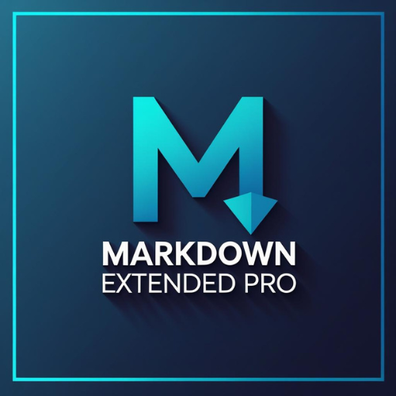

# Markdown Extended Pro

[](https://marketplace.visualstudio.com/items?itemName=jackdmf.markdown-extended-pro)
[](https://marketplace.visualstudio.com/items?itemName=jackdmf.markdown-extended-pro)
[](https://marketplace.visualstudio.com/items?itemName=jackdmf.markdown-extended-pro&ssr=false#review-details)

Markdown Extended Pro is a comprehensive extension that extends syntaxes and abilities to VSCode's built-in markdown functionality.

**Key Features:**

- 🎨 **Extended Syntax Support** - 17 integrated markdown-it plugins plus built-in syntaxes
- 📝 **Advanced Note Types** - Sidenotes, marginal notes, and sidebar annotations
- 📤 **WYSIWYG Exporter** - Export to HTML, PDF, PNG, JPEG matching the preview
- 🌗 **Theme-Aware & Accessible Exports** - Light / dark / auto export theme with a built-in, accessible base stylesheet (overridable by your own CSS)
- 🧜 **Mermaid in Exports** - Diagrams shown in VS Code's preview are rendered to inline SVG in exported files
- ✏️ **Editing Helpers** - Table formatting, text formatting toggles, and more
- 🌐 **Web Extension** - Works in [vscode.dev](https://vscode.dev) and [github.dev](https://github.dev) (preview & editing; export requires desktop)
- 🏗️ **TypeScript Codebase** - Built with TypeScript, unit tests, and error recovery

Export files aim to match the markdown preview, including syntaxes and styles contributed by other plugins.

> **Note:** Export to file (PDF, PNG, HTML) requires the desktop version of VS Code. In [vscode.dev](https://vscode.dev), all syntax highlighting, preview plugins, and editing helpers are available — only file export is unavailable.

> **New here?** Run **Welcome: Open Walkthrough…** from the command palette and pick **Get Started with Markdown Extended** for a guided tour of the syntax and export.

## Features

### Exporter

Export to Self Contained HTML / PDF / PNG / JPEG with perfect preview fidelity:

- Export current document / workspace
- Copy exported HTML to clipboard
- WYSIWYG export matches preview exactly
- Mermaid diagrams are rendered to inline SVG in the exported file (the Mermaid library is never embedded in the output)

Find commands in the command palette or right-click on an editor / workspace folder:

- `Markdown: Export to File`
- `Markdown: Export Markdown to File`

Export files are organized in the `out` directory in the workspace root by default.

### Editing Helpers

Command palette or right-click shortcuts for markdown editing:

- **Table Operations**: Paste as table, format table, add/delete/move columns & rows
- **Text Formatting**: Toggle bold, italic, underline, strikethrough, mark, code, block quote
- **Lists**: Toggle ordered/unordered lists, superscript, subscript
- **Smart Editing**: Auto-format tables, CSV to table conversion

See [Editing Helpers and Keys](#editing-helpers-and-keys) for details.

### Color Themes

Two included color themes for enhanced markdown syntax highlighting:

- **Markdown Extended Light** - Clean, readable colors matching Styles.css light mode
- **Markdown Extended Dark** - Eye-friendly dark theme matching Styles.css dark mode

**To activate**: Press `Ctrl+K Ctrl+T` and select "Markdown Extended Light" or "Markdown Extended Dark"

All colors extracted from the official Styles.css:

- Italic (*): Gold - Underline (_): Green - Bold (**): Purple - Strong (__): Cyan
- Strikethrough (~~): Pink/Red - Highlight (==): Orange
- Sidenotes, marginal notes, sidebars, TOC, footnotes with distinct colors

See [themes/README.md](./themes/README.md) for color mapping details.

### Extended Syntaxes

Built-in syntax extensions:

- **Sidenotes & Annotations** (built-in) - [View Document](#sidenotes-and-annotations)
  - Sidenotes: `++reference text|note content++`
  - Marginal notes: `!!reference text|note content!!`
  - Sidebars: `$left sidebar$` and `@right sidebar@`
- **Admonition** (built-in) - [View Document](#admonition)
- **Enhanced Anchor Link** (built-in) - Auto-slugify heading links

Integrated markdown-it plugins:

- [markdown-it-table-of-contents](https://www.npmjs.com/package/markdown-it-table-of-contents) - `[[TOC]]`
- [markdown-it-footnote](https://www.npmjs.com/package/markdown-it-footnote) - Footnote syntax
- [markdown-it-abbr](https://www.npmjs.com/package/markdown-it-abbr) - Abbreviations
- [markdown-it-deflist](https://www.npmjs.com/package/markdown-it-deflist) - Definition lists
- [markdown-it-sup-alt](https://www.npmjs.com/package/markdown-it-sup-alt) - Superscript `^text^`
- [markdown-it-sub-alt](https://www.npmjs.com/package/markdown-it-sub-alt) - Subscript `~text~`
- [markdown-it-checkbox](https://www.npmjs.com/package/markdown-it-checkbox) - Task lists
- [markdown-it-attrs](https://www.npmjs.com/package/markdown-it-attrs) - Add attributes `{.class #id}`
- [markdown-it-kbd](https://www.npmjs.com/package/markdown-it-kbd) - Keyboard keys `[[Ctrl+S]]`
- [markdown-it-ib](https://www.npmjs.com/package/markdown-it-ib) - Italic-bold support
- [markdown-it-mark](https://www.npmjs.com/package/markdown-it-mark) - Mark/highlight `==text==`
- [markdown-it-multimd-table](https://www.npmjs.com/package/markdown-it-multimd-table) - Advanced tables
- [markdown-it-emoji](https://www.npmjs.com/package/markdown-it-emoji) - Emoji support :smile:
- [markdown-it-html5-embed](https://www.npmjs.com/package/markdown-it-html5-embed) - Embed media
- [markdown-it-container](https://www.npmjs.com/package/markdown-it-container) - Custom containers
- [markdown-it-bracketed-spans](https://www.npmjs.com/package/markdown-it-bracketed-spans) - Span syntax
- [markdown-it-cjk-friendly](https://www.npmjs.com/package/markdown-it-cjk-friendly) - Fixes `**bold**`/`*italic*` next to CJK (Chinese/Japanese/Korean) text

> Post an issue on [GitHub][issues] if you want other plugins.

### Disable Plugins

To disable integrated plugins, add their names (comma-separated, without `markdown-it-` prefix) to settings:

```json
"markdownExtended.plugins.disabled": "ib, emoji, bracketed-spans"
```

> The pre-3.0 key `markdownExtended.disabledPlugins` still works but is deprecated.

**Available plugin names:** `table-of-contents`, `container`, `admonition`, `footnote`, `abbr`, `sup-alt`, `sub-alt`, `checkbox`, `attrs`, `kbd`, `ib`, `mark`, `deflist`, `emoji`, `multimd-table`, `html5-embed`, `sidenote`, `bracketed-spans`, `cjk-friendly`, `helper`

## Architecture & Development

This extension is built with:

- **Service-based structure**: Singleton services and separation of concerns
- **TypeScript**: Strongly typed source
- **Error Handling**: Error recovery and logging
- **Resource Management**: Cleanup, async operations, disposal of resources
- **Tests**: Unit tests with VS Code integration

For detailed architecture documentation, see [ARCHITECTURE.md](ARCHITECTURE.md).

## Works Well With Other Extensions

The extension works seamlessly with other markdown plugins that contribute to the built-in Markdown engine - **both in Preview and Export**:

- [Markdown Preview Github Styling](https://marketplace.visualstudio.com/items?itemName=bierner.markdown-preview-github-styles)
- [Markdown+Math](https://marketplace.visualstudio.com/items?itemName=goessner.mdmath)
- [Markdown Preview Mermaid Support](https://marketplace.visualstudio.com/items?itemName=bierner.markdown-mermaid)

The extension doesn't aim to do everything - use specialized plugins for deep features!

## Exporter

Find in command palette, or right click on an editor / workspace folder, and execute:

- `Markdown: Export to File`
- `Markdown: Export Markdown to File`

The export files are organized in `out` directory in the root of workspace folder by default.

### Export Configurations

Configure exports in **Settings** (search "Markdown Extended"). Settings are grouped under **pdf**, **image**, **export**, **plugins**, and **toc**. Highlights:

- `markdownExtended.export.theme` — `light`, `dark`, or `auto` (follows your VS Code theme; default)
- `markdownExtended.export.defaultStyles` — apply a built-in accessible base stylesheet to exports (on by default; **skipped when you set your own `markdown.styles`**)
- `markdownExtended.pdf.*` / `markdownExtended.image.*` — page format, margins, image quality, and more

> **v3.0:** settings were regrouped. Old flat keys (e.g. `markdownExtended.pdfFormat`) still work but are deprecated — please migrate to the grouped names.

After an export, use **Open** or **Reveal** in the notification to jump to the file. The first PDF/PNG/JPG export downloads a bundled Chromium once, with your consent.

You can also add per-file settings inside markdown front matter to override user settings (highest priority):

```markdown
---
puppeteer:
    pdf:
        format: A4
        displayHeaderFooter: true
        margin:
            top: 1cm
            right: 1cm
            bottom: 1cm
            left: 1cm
    image:
        quality: 90
        fullPage: true
---
contents goes here...
```

See all available settings for
[puppeteer.pdf](https://github.com/GoogleChrome/puppeteer/blob/v1.4.0/docs/api.md#pagepdfoptions), and
[puppeteer.image](https://github.com/GoogleChrome/puppeteer/blob/v1.4.0/docs/api.md#pagescreenshotoptions)

## Editing Helpers

### Editing Helpers and Keys

> Inspired by
[joshbax.mdhelper](https://marketplace.visualstudio.com/items?itemName=joshbax.mdhelper),
but totally new implements.

Default Keyboard Shortcut bindings are removed due to conflict issues on platforms, please consider:

- Switch to use command palette
- Switch to use [Snippets](#snippets)
- Setup key bindings on your own

| Command                       | Keyboard Shortcut                 |
| ----------------------------- | --------------------------------- |
| Format: Toggle Bold           | ~~Ctrl+B~~                        |
| Format: Toggle Italics        | ~~Ctrl+I~~                        |
| Format: Toggle Underline      | ~~Ctrl+U~~                        |
| Format: Toggle Mark           | ~~Ctrl+M~~                        |
| Format: Toggle Strikethrough  | ~~Alt+S~~                         |
| Format: Toggle Code Inline    | ~~Alt+`~~                         |
| Format: Toggle Code Block     | ~~Alt+Shift+`~~                   |
| Format: Toggle Block Quote    | ~~Ctrl+Shift+Q~~                  |
| Format: Toggle Superscript    | ~~Ctrl+Shift+U~~                  |
| Format: Toggle Subscript      | ~~Ctrl+Shift+L~~                  |
| Format: Toggle Unordered List | ~~Ctrl+L, Ctrl+U~~                |
| Format: Toggle Ordered List   | ~~Ctrl+L, Ctrl+O~~                |
| Table: Paste as Table         | ~~Ctrl+Shift+T, Ctrl+Shift+P~~    |
| Table: Format Table           | ~~Ctrl+Shift+T, Ctrl+Shift+F~~    |
| Table: Add Columns to Left    | ~~Ctrl+Shift+T, Ctrl+Shift+L~~    |
| Table: Add Columns to Right   | ~~Ctrl+Shift+T, Ctrl+Shift+R~~    |
| Table: Add Rows Above         | ~~Ctrl+Shift+T, Ctrl+Shift+A~~    |
| Table: Add Row Below          | ~~Ctrl+Shift+T, Ctrl+Shift+B~~    |
| Table: Move Columns Left      | ~~Ctrl+Shift+T Ctrl+Shift+Left~~  |
| Table: Move Columns Right     | ~~Ctrl+Shift+T Ctrl+Shift+Right~~ |
| Table: Delete Rows            | ~~Ctrl+Shift+D, Ctrl+Shift+R~~    |
| Table: Delete Columns         | ~~Ctrl+Shift+D, Ctrl+Shift+C~~    |

> Looking for `Move Rows Up / Down`?  
> You can use vscode built-in `Move Line Up / Down`, shortcuts are `alt+↑` and `alt+↓`

### Snippets

| Index | Prefix                | Context                          | View                                      |
| ----- | --------------------- | -------------------------------- | ----------------------------------------- |
| 0     | `underline`           | `_under_ line`                   | _under_ line                              |
| 1     | `mark`                | `==mark==`                       | ==mark==                                  |
| 2     | `subscript`           | `~sub~script`                    | ~sub~script                               |
| 3     | `superscript`         | `^super^script`                  | ^super^script                             |
| 4     | `checkbox`            | `[] checkbox`                    | [ ] checkbox                              |
| 5     | `tasklist`            | `- [] task`                      | - [ ] task                                |
| 6     | `table`               | Markdown table                   | See [Paste as Table](#table-editing)      |
| 7     | `kbd`                 | Keyboard tag                     | Keyboard shortcut                         |
| 8     | `admonition` / `note` | Admonition block                 | [Admonition](#admonition)                 |
| 9     | `sidenote`            | `++ref\|note++`                  | [Sidenote](#sidenotes-and-annotations)    |
| 10    | `marginnote`          | `!!ref\|note!!`                  | [Marginal](#sidenotes-and-annotations)    |
| 11    | `footnote`            | `[^abc]` and `[^abc]: ABC`       | [Footnote](#markdown-it-footnote)         |
| 12    | `container`           | Custom container                 | [Container](#markdown-it-container)       |
| 13    | `abbr`                | `*[ABBR]: Abbreviation`          | [Abbr](#markdown-it-abbr)                 |
| 14    | `attr`                | `**attr**{style="color:red"}`    | Styled text                               |
| 15    | `color`               | Text with color                  | Colored text                              |

### Table Editing


> Move columns key bindings has been changed to `ctrl+shift+t ctrl+shift+left/right`, due to [#57](https://github.com/JackDMF/vscode-markdown-extended/issues/57), [#68](https://github.com/JackDMF/vscode-markdown-extended/issues/68)

### Paste as Markdown Table

Copy a table from Excel, Web and other applications which support the format of Comma-Separated Values (CSV), then run the command `Paste as Markdown Table`, you will get the markdown table.


### Export & Copy


## Syntax Documentation

### Sidenotes and Annotations

This extension provides powerful annotation features with full markdown support:

#### Sidenotes

Sidenotes appear as floating annotations next to your text:

```markdown
This is main text with ++reference text|This is the sidenote content with **markdown** support++.
```

#### Marginal Notes

Marginal notes appear in the document margin:

```markdown
This is main text with !!reference text|This is the marginal note with *italic* text!!.
```

#### Sidebars

Left and right sidebar annotations for additional context:

```markdown
$This appears in the left sidebar with [links](url) and other markdown$

@This appears in the right sidebar with `code` and formatting@
```

**Features:**

- Full markdown support within notes (bold, italic, links, code, etc.)
- Recursion depth limiting for safety
- Graceful error handling

**CSS Classes:**

- Sidenotes: `.sn-ref` (reference), `.sidenote` (content)
- Marginal notes: `.mn-ref` (reference), `.mnote` (content)
- Sidebars: `.left-sidebar`, `.right-sidebar`

### Admonition

> Inspired by [MkDocs](https://squidfunk.github.io/mkdocs-material/extensions/admonition/)

Nesting supported (by indent) admonition, the following shows a danger admonition nested by a note admonition.

```markdown
!!! note

    This is the **note** admonition body

    !!! danger Danger Title
        This is the **danger** admonition body
```


#### Removing Admonition Title

```markdown
!!! danger ""
    This is the danger admonition body
```


#### Supported Qualifiers

`note` | `summary, abstract, tldr` | `info, todo` | `tip, hint` | `success, check, done` | `question, help, faq` | `warning, attention, caution` | `failure, fail, missing` | `danger, error, bug` | `example, snippet` | `quote, cite`

See also: [Python-Markdown Documentation for Admonitions](https://python-markdown.github.io/extensions/admonition/)

### markdown-it-table-of-contents

```markdown
[[TOC]]
```

Generates a table of contents from document headings.

### markdown-it-footnote

```markdown
Here is a footnote reference,[^1] and another.[^longnote]

[^1]: Here is the footnote.
[^longnote]: Here's one with multiple blocks.
```

Example output: Here is a footnote reference with superscript links.

### markdown-it-abbr

```markdown
*[HTML]: Hyper Text Markup Language
*[W3C]:  World Wide Web Consortium
The HTML specification
is maintained by the W3C.
```

The HTML specification is maintained by the W3C (with abbreviation tooltips).

### markdown-it-deflist

```markdown
Apple
:   Pomaceous fruit of plants of the genus Malus in the family Rosaceae.
```

Creates definition lists with terms and definitions.

### markdown-it-sup markdown-it-sub

```markdown
29^th^, H~2~O
```

Example: 29<sup>th</sup>, H<sub>2</sub>O

### markdown-it-checkbox

```markdown
[ ] unchecked
[x] checked
```

Creates interactive checkboxes in preview.

### markdown-it-attrs

```markdown
item **bold red**{style="color:red"}
```

Example: item **bold red** (styled with inline CSS)

Attributes also apply to the built-in sidenotes, marginal notes, and sidebars. Add `{.class #id key=val}` right after the closing marker:

```markdown
++ref|note++{.my-class}
!!ref|note!!{.my-class}
$left sidebar${.my-class}
@right sidebar@{.my-class}
```

### markdown-it-kbd

```markdown
[[Ctrl+Esc]]
```

Renders keyboard shortcuts with proper styling.

### markdown-it-ib

```markdown
_underline_
```

Provides italic-bold support with underline rendering.

### markdown-it-container

```markdown
::::: container
:::: row
::: col-xs-6 alert alert-success
success text
:::
::: col-xs-6 alert alert-warning
warning text
:::
::::
:::::
```


_Rendered with Bootstrap styles. To see the same result, add this config:_

```json
"markdown.styles": [
    "https://maxcdn.bootstrapcdn.com/bootstrap/4.0.0/css/bootstrap.min.css"
]
```

## Known Issues & Feedback

Please post and view issues on [GitHub][issues]

**Enjoy!**

[issues]: https://github.com/JackDMF/vscode-markdown-extended/issues "Post issues"
