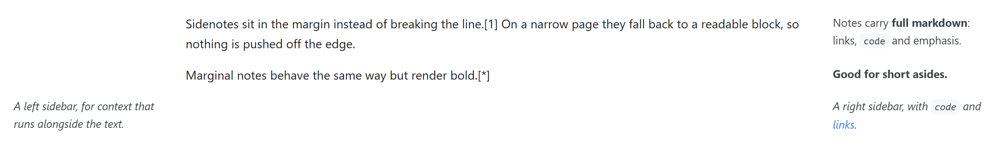
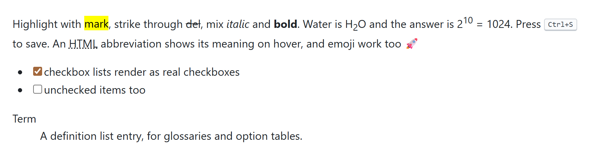
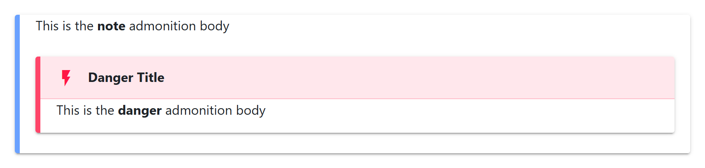
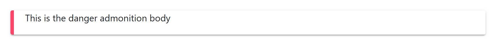
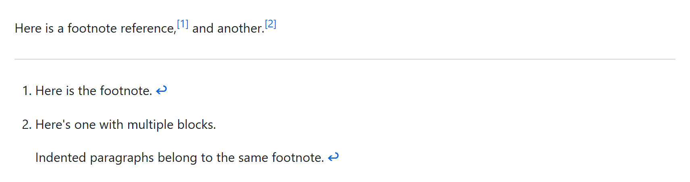
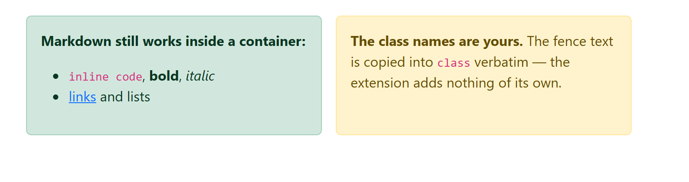

# Markdown Extended Pro

[](https://marketplace.visualstudio.com/items?itemName=jackdmf.markdown-extended-pro)
[](https://marketplace.visualstudio.com/items?itemName=jackdmf.markdown-extended-pro)
[](https://marketplace.visualstudio.com/items?itemName=jackdmf.markdown-extended-pro&ssr=false#review-details)

Markdown Extended Pro is a comprehensive extension that extends syntaxes and abilities to VSCode's built-in markdown functionality.

**Key Features:**

- 🎨 **Extended Syntax Support** - 17 integrated markdown-it plugins plus built-in syntaxes
- 📝 **Advanced Note Types** - Sidenotes, marginal notes, and sidebar annotations
- 📤 **Pixel-Perfect Exporter** - Export to HTML, PDF, PNG, JPEG matching the preview
- 🌗 **Theme-Aware & Accessible Exports** - Light / dark / auto export theme with a built-in, accessible base stylesheet (overridable by your own CSS)
- 🧜 **Mermaid in Exports** - Diagrams shown in VS Code's preview are rendered to inline SVG in exported files
- ✏️ **Editing Helpers** - Table formatting, text formatting toggles, and more
- 🖋️ **Visual Editor** - Edit as rendered text; untouched blocks are saved byte for byte, and the front matter is a properties panel edited in place ([details](#visual-editor))
- 🌐 **Web Extension** - Works in [vscode.dev](https://vscode.dev) and [github.dev](https://github.dev) (preview & editing; export requires desktop)
- 🏗️ **TypeScript Codebase** - Built with TypeScript, unit tests, and error recovery

Export files aim to match the markdown preview, including syntaxes and styles contributed by other plugins.

> **Note:** Export to file (PDF, PNG, HTML) requires the desktop version of VS Code. In [vscode.dev](https://vscode.dev), all syntax highlighting, preview plugins, and editing helpers are available — only file export is unavailable.

> **New here?** Run **Welcome: Open Walkthrough…** from the command palette and pick **Get Started with Markdown Extended** for a guided tour of the syntax and export.

## Features

### Exporter

Export to Self Contained HTML / PDF / PNG / JPEG with perfect preview fidelity:

- Export current document / workspace (the export command takes an optional uri, so a menu or another extension can name the document)
- Copy exported HTML to clipboard
- Export matches the preview exactly, pixel for pixel
- Mermaid diagrams are rendered to inline SVG in the exported file (the Mermaid library is never embedded in the output)

Find commands in the command palette or right-click on an editor / workspace folder:

- `Markdown: Export to File`
- `Markdown: Export Markdown to File`

Export files are organized in the `out` directory in the workspace root by default.

### Editing Helpers

Command palette or right-click shortcuts for markdown editing:

- **Table Operations**: Paste as table, format table, add/delete/move columns & rows
- **Text Formatting**: Toggle bold, italic, underline, strikethrough, mark, code, block quote
- **Lists**: Toggle ordered/unordered lists, superscript, subscript
- **Smart Editing**: Auto-format tables, CSV to table conversion

See [Editing Helpers and Keys](#editing-helpers-and-keys) for details.

### Color Themes

Two included color themes for enhanced markdown syntax highlighting:

- **Markdown Extended Light** - Clean, readable colors matching Styles.css light mode
- **Markdown Extended Dark** - Eye-friendly dark theme matching Styles.css dark mode

**To activate**: Press `Ctrl+K Ctrl+T` and select "Markdown Extended Light" or "Markdown Extended Dark"

All colors extracted from the official Styles.css:

- Italic (*): Gold - Underline (_): Green - Bold (**): Purple - Strong (__): Cyan
- Strikethrough (~~): Pink/Red - Highlight (==): Orange
- Sidenotes, marginal notes, sidebars, TOC, footnotes with distinct colors

See [themes/README.md](./themes/README.md) for color mapping details.

### Extended Syntaxes

Built-in syntax extensions:

- **Sidenotes & Annotations** (built-in) - [View Document](#sidenotes-and-annotations)
  - Sidenotes: `++reference text|note content++`
  - Marginal notes: `!!reference text|note content!!`
  - Sidebars: `$left sidebar$` and `@right sidebar@`
- **Admonition** (built-in) - [View Document](#admonition)
- **Enhanced Anchor Link** (built-in) - Auto-slugify heading links

Integrated markdown-it plugins:

- [markdown-it-table-of-contents](https://www.npmjs.com/package/markdown-it-table-of-contents) - `[[TOC]]`
- [markdown-it-footnote](https://www.npmjs.com/package/markdown-it-footnote) - Footnote syntax
- [markdown-it-abbr](https://www.npmjs.com/package/markdown-it-abbr) - Abbreviations
- [markdown-it-deflist](https://www.npmjs.com/package/markdown-it-deflist) - Definition lists
- [markdown-it-sup-alt](https://www.npmjs.com/package/markdown-it-sup-alt) - Superscript `^text^`
- [markdown-it-sub-alt](https://www.npmjs.com/package/markdown-it-sub-alt) - Subscript `~text~`
- [markdown-it-checkbox](https://www.npmjs.com/package/markdown-it-checkbox) - Task lists
- [markdown-it-attrs](https://www.npmjs.com/package/markdown-it-attrs) - Add attributes `{.class #id}`
- [markdown-it-kbd](https://www.npmjs.com/package/markdown-it-kbd) - Keyboard keys `[[Ctrl+S]]`
- [markdown-it-ib](https://www.npmjs.com/package/markdown-it-ib) - Italic-bold support
- [markdown-it-mark](https://www.npmjs.com/package/markdown-it-mark) - Mark/highlight `==text==`
- [markdown-it-multimd-table](https://www.npmjs.com/package/markdown-it-multimd-table) - Advanced tables
- [markdown-it-emoji](https://www.npmjs.com/package/markdown-it-emoji) - Emoji support :smile:
- [markdown-it-html5-embed](https://www.npmjs.com/package/markdown-it-html5-embed) - Embed media
- [markdown-it-container](https://www.npmjs.com/package/markdown-it-container) - Custom containers
- [markdown-it-bracketed-spans](https://www.npmjs.com/package/markdown-it-bracketed-spans) - Span syntax
- [markdown-it-cjk-friendly](https://www.npmjs.com/package/markdown-it-cjk-friendly) - Fixes `**bold**`/`*italic*` next to CJK (Chinese/Japanese/Korean) text

> Post an issue on [GitHub][issues] if you want other plugins.

### Disable Plugins

To disable integrated plugins, add their names (comma-separated, without `markdown-it-` prefix) to settings:

```json
"markdownExtended.plugins.disabled": "ib, emoji, bracketed-spans"
```

> The pre-3.0 key `markdownExtended.disabledPlugins` still works but is deprecated.

**Available plugin names:** `table-of-contents`, `container`, `admonition`, `footnote`, `abbr`, `sup-alt`, `sub-alt`, `checkbox`, `attrs`, `wiki-embed`, `kbd`, `ib`, `mark`, `deflist`, `emoji`, `multimd-table`, `html5-embed`, `sidenote`, `bracketed-spans`, `cjk-friendly`, `helper`

## Architecture & Development

This extension is built with:

- **Service-based structure**: Singleton services and separation of concerns
- **TypeScript**: Strongly typed source
- **Error Handling**: Error recovery and logging
- **Resource Management**: Cleanup, async operations, disposal of resources
- **Tests**: Unit tests with VS Code integration

For detailed architecture documentation, see
[ARCHITECTURE.md](https://github.com/JackDMF/vscode-markdown-extended/blob/master/ARCHITECTURE.md)
in the repository.

## Works Well With Other Extensions

The extension works seamlessly with other markdown plugins that contribute to the built-in Markdown engine - **both in Preview and Export**:

- [Markdown Preview Github Styling](https://marketplace.visualstudio.com/items?itemName=bierner.markdown-preview-github-styles)
- [Markdown+Math](https://marketplace.visualstudio.com/items?itemName=goessner.mdmath)
- [Markdown Preview Mermaid Support](https://marketplace.visualstudio.com/items?itemName=bierner.markdown-mermaid)

The extension doesn't aim to do everything - use specialized plugins for deep features!

## Exporter

Find in command palette, or right click on an editor / workspace folder, and execute:

- `Markdown: Export to File`
- `Markdown: Export Markdown to File`

The export files are organized in `out` directory in the root of workspace folder by default.

### Export Configurations

Configure exports in **Settings** (search "Markdown Extended"). Settings are grouped under **pdf**, **image**, **export**, **plugins**, and **toc**. Highlights:

- `markdownExtended.export.theme` — `light`, `dark`, or `auto` (follows your VS Code theme; default)
- `markdownExtended.export.defaultStyles` — apply a built-in accessible base stylesheet to exports (on by default; **skipped when you set your own `markdown.styles`**)
- `markdownExtended.pdf.*` / `markdownExtended.image.*` — page format, margins, image quality, and more
- `markdownExtended.pdf.locale` — the locale of the print date in the PDF header/footer templates (BCP 47, e.g. `de-DE`); empty follows VS Code's display language. The element you mark with class `date` is printed with class `print-date` instead
- `markdownExtended.export.outDirName` — where exports go. A plain name (`out`, the default) is a directory under the workspace root; an **absolute path** writes outside the workspace entirely, which is handy when the workspace lives in a repository but the files should end up in a synced folder you can open on a tablet. Either way the document's position inside the workspace is mirrored beneath it.

> **v3.0:** settings were regrouped. Old flat keys (e.g. `markdownExtended.pdfFormat`) still work but are deprecated — please migrate to the grouped names.

After an export, use **Open** or **Reveal** in the notification to jump to the file. The first PDF/PNG/JPG export downloads a bundled Chromium once, with your consent.

You can also add per-file settings inside markdown front matter to override user settings (highest priority):

```markdown
---
puppeteer:
    pdf:
        format: A4
        displayHeaderFooter: true
        margin:
            top: 1cm
            right: 1cm
            bottom: 1cm
            left: 1cm
    image:
        quality: 90
        fullPage: true
---
contents goes here...
```

See all available settings for
[puppeteer.pdf](https://github.com/GoogleChrome/puppeteer/blob/v1.4.0/docs/api.md#pagepdfoptions), and
[puppeteer.image](https://github.com/GoogleChrome/puppeteer/blob/v1.4.0/docs/api.md#pagescreenshotoptions)

## Editing Helpers

### Editing Helpers and Keys

> Inspired by
[joshbax.mdhelper](https://marketplace.visualstudio.com/items?itemName=joshbax.mdhelper),
but totally new implements.

Default Keyboard Shortcut bindings are removed due to conflict issues on platforms, please consider:

- Switch to use command palette
- Switch to use [Snippets](#snippets)
- Setup key bindings on your own

| Command                       | Keyboard Shortcut                 |
| ----------------------------- | --------------------------------- |
| Format: Toggle Bold           | ~~Ctrl+B~~                        |
| Format: Toggle Italics        | ~~Ctrl+I~~                        |
| Format: Toggle Underline      | ~~Ctrl+U~~                        |
| Format: Toggle Mark           | ~~Ctrl+M~~                        |
| Format: Toggle Strikethrough  | ~~Alt+S~~                         |
| Format: Toggle Code Inline    | ~~Alt+`~~                         |
| Format: Toggle Code Block     | ~~Alt+Shift+`~~                   |
| Format: Toggle Block Quote    | ~~Ctrl+Shift+Q~~                  |
| Format: Toggle Superscript    | ~~Ctrl+Shift+U~~                  |
| Format: Toggle Subscript      | ~~Ctrl+Shift+L~~                  |
| Format: Toggle Unordered List | ~~Ctrl+L, Ctrl+U~~                |
| Format: Toggle Ordered List   | ~~Ctrl+L, Ctrl+O~~                |
| Table: Paste as Table         | ~~Ctrl+Shift+T, Ctrl+Shift+P~~    |
| Table: Format Table           | ~~Ctrl+Shift+T, Ctrl+Shift+F~~    |
| Table: Add Columns to Left    | ~~Ctrl+Shift+T, Ctrl+Shift+L~~    |
| Table: Add Columns to Right   | ~~Ctrl+Shift+T, Ctrl+Shift+R~~    |
| Table: Add Rows Above         | ~~Ctrl+Shift+T, Ctrl+Shift+A~~    |
| Table: Add Row Below          | ~~Ctrl+Shift+T, Ctrl+Shift+B~~    |
| Table: Move Columns Left      | ~~Ctrl+Shift+T Ctrl+Shift+Left~~  |
| Table: Move Columns Right     | ~~Ctrl+Shift+T Ctrl+Shift+Right~~ |
| Table: Delete Rows            | ~~Ctrl+Shift+D, Ctrl+Shift+R~~    |
| Table: Delete Columns         | ~~Ctrl+Shift+D, Ctrl+Shift+C~~    |

> Looking for `Move Rows Up / Down`?  
> You can use vscode built-in `Move Line Up / Down`, shortcuts are `alt+↑` and `alt+↓`

### Snippets

| Index | Prefix                | Context                          | View                                      |
| ----- | --------------------- | -------------------------------- | ----------------------------------------- |
| 0     | `underline`           | `_under_ line`                   | _under_ line                              |
| 1     | `mark`                | `==mark==`                       | ==mark==                                  |
| 2     | `subscript`           | `~sub~script`                    | ~sub~script                               |
| 3     | `superscript`         | `^super^script`                  | ^super^script                             |
| 4     | `checkbox`            | `[] checkbox`                    | [ ] checkbox                              |
| 5     | `tasklist`            | `- [] task`                      | - [ ] task                                |
| 6     | `table`               | Markdown table                   | See [Paste as Table](#table-editing)      |
| 7     | `kbd`                 | Keyboard tag                     | Keyboard shortcut                         |
| 8     | `admonition` / `note` | Admonition block                 | [Admonition](#admonition)                 |
| 9     | `sidenote`            | `++ref\|note++`                  | [Sidenote](#sidenotes-and-annotations)    |
| 10    | `marginnote`          | `!!ref\|note!!`                  | [Marginal](#sidenotes-and-annotations)    |
| 11    | `footnote`            | `[^abc]` and `[^abc]: ABC`       | [Footnote](#markdown-it-footnote)         |
| 12    | `container`           | Custom container                 | [Container](#markdown-it-container)       |
| 13    | `abbr`                | `*[ABBR]: Abbreviation`          | [Abbr](#markdown-it-abbr)                 |
| 14    | `attr`                | `**attr**{style="color:red"}`    | Styled text                               |
| 15    | `color`               | Text with color                  | Colored text                              |

### Table Editing

**Format Table** rewrites a table so the pipes line up, padding every cell to the
width of its column and preserving each column's alignment marker:

```markdown
| Command | Shortcut | Notes |
|---|:--:|--:|
| Format Table | Ctrl+Shift+T | tidies alignment |
| Move Columns | Ctrl+Shift+Left | keeps the header |
```

becomes

```markdown
| Command      |    Shortcut     |            Notes |
| ------------ | :-------------: | ---------------: |
| Format Table |  Ctrl+Shift+T   | tidies alignment |
| Move Columns | Ctrl+Shift+Left | keeps the header |
```

The remaining table commands act on the table under the cursor, and reformat it
afterwards so it stays aligned:

| Command                     | Effect                                              |
| --------------------------- | --------------------------------------------------- |
| Add Columns to Left / Right | Inserts a column beside the one holding the cursor  |
| Add Rows Above / Below      | Inserts a row next to the current one               |
| Move Columns Left / Right   | Swaps a whole column, header and alignment included |
| Delete Rows / Delete Columns | Removes the current row or column                  |

Every one is on the command palette. No keyboard shortcuts are bound by default -
see [Editing Helpers and Keys](#editing-helpers-and-keys) for why, and for the
bindings to copy if you want them back.

> For `Move Rows Up / Down`, use VS Code's built-in `Move Line Up / Down`
> (`alt+up` / `alt+down`).

### Paste as Markdown Table

Copy a table from Excel, a web page, or anything else that puts Comma-Separated
Values on the clipboard, then run **Paste as Table**. This clipboard content:

```text
Command,Shortcut,Notes
Format Table,Ctrl+Shift+T,tidies alignment
Move Columns,Ctrl+Shift+Left,keeps the header
```

is inserted as:

```markdown
| Command      | Shortcut        | Notes            |
| ------------ | --------------- | ---------------- |
| Format Table | Ctrl+Shift+T    | tidies alignment |
| Move Columns | Ctrl+Shift+Left | keeps the header |
```

The first row becomes the header, and the table is aligned on insert.

### Export & Copy

| Command                            | What it does                                                     |
| ---------------------------------- | ---------------------------------------------------------------- |
| Export to File                     | Exports the current document to HTML, PDF, PNG or JPG            |
| Export Markdown to File            | Exports every Markdown file in the workspace                     |
| Copy HTML                          | Puts the rendered HTML on the clipboard                          |
| Copy HTML & Styles                 | The same, with the stylesheets inlined so it survives pasting    |
| Install Chromium Browser for Export | Downloads the Chromium that PDF and image export need            |

Search "Markdown" in the command palette (`Ctrl+Shift+P`) to reach them; export is
also on the editor title menu and the explorer context menu.

## Visual Editor

Visual Editor: you edit the document as it reads; the technique is a rich-text editor
over the file's own text.

Edit a Markdown file as rendered text — headings, paragraphs, lists, quotes and code
typed in place — and save a file that differs from the original **only where you
changed it**. The text editor stays the default; the Visual Editor is chosen per file.

### Opening it

- **Command palette:** `Markdown: Open in Visual Editor` on the active Markdown file.
- **Context menu:** right-click a `.md` file in the explorer, or inside a Markdown
  editor, and choose **Open in Visual Editor**.
- **Open With…:** on any `.md` or `.markdown` tab or file, **Open With…** →
  **Markdown Visual Editor**. The same menu can make it the default for `*.md` if you
  want that.

It edits the same document as the text editor: dirty state, save and the file's undo
history are VS Code's, and the text editor and the Visual Editor can be open side by
side on one file, each following the other's changes.

### What is edited in place

Paragraphs, headings, bullet and ordered lists, block quotes, fenced and indented code
blocks and horizontal rules, and inside them:

- bold, italic, emphasis, strong, inline code, links and images;
- this extension's inline syntax — highlight (`==mark==`), superscript (`^sup^`),
  subscript (`~sub~`), strikethrough (`~~del~~`) and keys (`[[Ctrl+S]]`);
- sidenotes (`++reference|note++`), marginal notes (`!!reference|note!!`) and left and
  right sidebars (`$left$`, `@right@`), drawn exactly as the preview draws them — in the
  margin in a wide window — with the reference and the note each edited as rich text. A
  heading may hold a note too;
- attribute spans (`[text]{.class}`, `[text]{#id style="…"}`), drawn with exactly the
  attributes the preview gives them, so your stylesheets style them for real; the `{…}`
  is kept as you wrote it.

And these blocks, edited in place with their content as rich text:

- **Admonitions** (`!!! warning "Title"` with an indented body), drawn as the preview
  draws them — the coloured box, the title bar, the icon. The body is edited like any
  text; the type and the title are changed from its bar (below).
- **Containers** (`::: name info` … `:::`), a block with the classes its opening line
  names, outlined in the editor since most class names draw nothing. A container may hold
  another, one level deep; the outer fence is lengthened when it has to be.
- **Block attributes** — `{.class}` or `{#id}` at the end of a paragraph's last line or on
  a line of its own under it, under a list, at the end of a list item's first paragraph, as
  `> {.x}` under a quote's last paragraph, under a table after a blank line, on a fence's
  opening line, after a rule — are kept verbatim and written back where they stood; the
  block is drawn with them. A heading's `{#anchor}` stays as it always was.
  **Formatting → Attributes…** sets them (below).
- **Pipe tables** — a header row, the delimiter row with its `:` alignment, body rows —
  with each cell's text edited like a paragraph's (emphasis, code, links, images, highlight,
  keys, sidebars). Rows and columns are added, deleted and aligned from the table's bar
  (below). A changed table is written as **Format Table** writes one: pipes lined up, every
  cell padded to its column, `|` in a cell as `\|`; an untouched one byte for byte. A table
  using markdown-it-multimd-table's extensions — a colspan (`||`), a rowspan (`^^`), a
  multi-line row, a caption, no header row, a second body — stays a source block, labelled
  _Source · multimd table_.

Format them from the toolbar (below) or with the keys a Markdown author already knows:

| Keys | Does |
| ---- | ---- |
| `Ctrl+B` / `Ctrl+I` / ``Ctrl+` `` | Bold / italic / inline code |
| `Enter`, `Tab`, `Shift+Tab` in a list | New item / indent / outdent |
| `Ctrl+Z`, `Ctrl+Y` or `Ctrl+Shift+Z` | Undo / redo |
| `# ` … `###### ` at the start of a line | Heading of that level |
| `- ` or `* `, `1. `, `> ` at the start of a line | Bullet list, ordered list, quote |
| ` ``` ` at the start of a line | Code block |

`Ctrl+I` writes `*italic*` and `Ctrl+B` `**bold**`, the CommonMark defaults, and one press
removes emphasis or bold whichever delimiter it was written with. Blocks the toolbar
inserts go after the block you are in — after the last one when the whole document is
selected — and never above the first.

**Inside a note or a sidebar:**

| Keys | Does |
| ---- | ---- |
| `Tab` or `Enter` in the reference | To the note's text |
| `Tab` or `Enter` in the note, or a sidebar | Out of it, the caret after it |
| `Shift+Tab` | Back: note to reference, reference to before the note |
| `Esc` | Out of it, the caret after it |
| `→` at the end, `←` at the start | On to the next part, or out; from outside, `→`/`←` go in |
| `Backspace` at the start of an empty reference or sidebar | Removes the whole note |
| `Backspace` at the start of a reference with text | Selects the note; a second press removes it |

The reference and the note stay two parts: `Delete` at the end of one does not join them,
and pasting into a note pastes its text.

To remove, convert or edit a note as a whole, use its bar (below).

**Inside an admonition or a container:**

| Keys | Does |
| ---- | ---- |
| `Enter` in an empty last paragraph | Leaves it: the caret goes to a new paragraph after it |
| `Backspace` at the start of an empty first paragraph | Removes the admonition or container, keeping its content |

**Inside a table:**

| Keys | Does |
| ---- | ---- |
| `Tab` / `Shift+Tab` | To the next / previous cell, its text selected; `Tab` in the last cell adds a row |
| `Enter` | To the cell below; in the last row adds a row; in an empty last row leaves the table |
| `Shift+Enter` | Refused: a cell holds one line |
| Arrow keys, a drag across cells | Move between cells, select cells |

### Every object carries its verbs

A note, a link, an image, a source block, an included snippet: each is an *object*, and
each shows the same small bar — its name on the left, then what can be done with it. An
inline object's bar sits above its line (below it when there is no room above); a block's
bar goes where there is no text — beside the block's first line when the block is narrow,
else above it, inside its top-right corner or below it. A bar never covers the line you
are typing on, and never moves the page.

| Object | Its bar shows | Verbs |
| ------ | ------------- | ----- |
| Sidenote, marginal note | while the caret is inside, after a moment | **Remove note, keep text** · **Convert to marginal note** / **Convert to sidenote** · **Edit source** |
| Left or right sidebar | while the caret is inside, after a moment | **Remove sidebar, keep text** · **Move to right** / **Move to left** · **Edit source** |
| Link | while the caret is in its text, after a moment | **Open** · **Edit link…** · **Remove link** |
| Span (`[text]{…}`) | while the caret is in its text, after a moment | **Edit attributes** · **Remove attributes, keep text** |
| Image | when you click it, after a moment | **Edit image…** (its alt text, then its path) · **Open file** · **Remove image** |
| Admonition | while the caret is in it, after a moment, or a click on its title | **Change type** (a menu of every type) · **Edit title** · **Attributes…** (disabled: the plugin gives a `{…}` to the title bar) · **Remove admonition, keep content** |
| Container | while the caret is in it, after a moment | **Change name/info** · **Attributes…** (disabled: the container's renderer drops a `{…}`) · **Remove container, keep content** |
| A block with attributes (`{.lead}`) | while the caret is in it, after a moment | **Attributes…** (`{}` or empty removes them) |
| Table | while the caret is in it, after a moment; the caret's column is tinted | **Row** (insert above, insert below, delete) · **Column** (insert left, insert right, delete) · **Align** (left, center, right; the current one marked) · **Attributes…** · **Edit source** · **Delete table** |
| Source block — a multimd table, raw HTML, a definition list, … | while the pointer is on it, or it is selected | **Edit source** · **Show in text editor** · **Delete block** |
| Included snippet | while the pointer is on it, or it is selected | **Open snippet** (when Req Explorer names its file) · **Change snippet…** · **Show in text editor** · **Delete directive** |
| A status badge, a summary table | as above | its name only |
| Front matter | — | its verbs are the properties panel's header (below); the bar shows only for other extensions' actions |
| Heading | while the caret is in it, after a moment — only when another extension offers actions for it, or the heading has attributes | **Attributes…** (not on a requirement heading), then the actions; a requirement heading is named by its id |

A block's bar — a source block, a snippet, the front matter, a heading, a container, an
admonition, a block with attributes — also offers the **code actions other extensions
have for that block**, after its own verbs (see below).

- **A verb says what remains.** *Remove note, keep text* leaves the note's reference in
  the sentence, with its formatting (a sidebar leaves its text); the note's own text goes.
  *Remove link* keeps the linked text. *Delete directive* removes the
  `<!-- include: … -->` line from the file; the snippet's own file stays.
- **A removal says so.** Something disappearing is easy to miss, so a removal or deletion
  is announced beside the caret for a moment — *Note removed — Ctrl+Z* — and one `Ctrl+Z`
  brings it back.
- **Edit source, Edit link…, Edit image…, Edit attributes, Edit title, Change
  name/info** open a one-line field in the bar, filled in: `Enter` applies (or goes on to
  the next field — *Edit image…* asks for the alt text, then the path), `Esc` or clicking
  away cancels. A link's address and an image's path complete as you type (below, *Links*). An attribute field takes a `{…}` as markdown-it-attrs reads it
  (`{.a .b}`, `{#id}`, `{key="value"}`) and refuses anything else, saying why beside the
  caret. **Change type** opens a list of the admonition types instead. A note's field holds its Markdown
  (`++reference|note++`); what you type is read by the same parser as the preview, so it
  comes back as a note — of whichever kind its markers now say — or, if it no longer is
  one, as the text you typed. A source block's **Edit source** opens its Markdown in the
  block itself, as before (below).
- The note buttons in the Annotation menu and the bubble still remove a note too: inside
  one they show as active, and choosing one removes it, text kept.

| Keys | Does |
| ---- | ---- |
| `Alt+Enter` | Opens the bar of the object at the caret, the focus on its first verb |
| `←` / `→` | Moves between the verbs |
| `Enter` | Chooses the verb; in a field, applies it |
| `Esc` | Back to the text; in a field, cancels

### Lenses and actions from other extensions

Extensions attach things to the text editor: Req Explorer puts a row of *code lenses* on
every requirement heading — its status, priority, links, evidence, **+ ref** — and offers
*code actions* (quick fixes) where its checks find something. The Visual Editor shows
both, without any arrangement between the extensions: it asks VS Code for them, the same
way the text editor does, so what one shows the other shows.

- **A lens is placed on the element it is about.** In the text editor a lens row stands in
  for a view the text cannot show; here the view is on the page — a requirement's summary
  table — and a row repeating it would say everything twice. So a lens that names its
  surface runs from that element: the table's **Status** row runs the status lens (the
  status badge beside the heading, where Req Explorer draws one because no table repeats
  it), the **Priority** row the priority lens, a **relation row** (_Verified by_,
  _Depends on_, …) the lens of that relation — its picker. **What a click does shows on
  hover, one look per kind of verb:** a lens that *sets* something — the status chip, the
  priority value, the badge — looks like a dropdown on hover, a soft rounded surface and a
  `▾` after the value; a lens that *goes* somewhere — a relation's label (_Verified by_),
  which opens its picker — is underlined, like the links beside it. The targets in a
  relation row are links, and **a plain click on a link in the summary opens it**: the
  table is a read model, nothing in it is edited here, so the Ctrl+click rule of text
  protects nothing. At rest everything looks exactly as in the preview; the tooltip names
  what a click does, and the keyboard's focus shows the same as the pointer.
  `Tab` reaches them, `Enter` runs the focused one. A lens that is a verb (**+ ref**) is a
  verb in the heading's object toolbar — the caret resting in the heading shows it — and
  so is a lens whose element the page does not show (a count for a relation the table
  hides); past four, the first three stay and the rest are behind **Actions**.
- **The other extension says where a lens goes; the editor does not guess.** A lens names
  its surface in the last of its command's arguments,
  `{ reqExplorer: { surface: 'status' | 'priority' | 'links' | 'action', artifact: 'FR-X-001', relation?: 'verified-by', direction?: 'out' | 'in' } }`,
  and the editor finds the badge and the table rows injected for that artifact — on the
  heading the lens stands on first, so two headings sharing an id each keep their own; the
  `direction` tells the two rows of a symmetric relation apart. Req Explorer does this for
  its own lenses. A collapsed list's "12 tests" in a row opens the list, and so shows no
  underline or tooltip of the lens.
- **Every other lens stands as a row** above the block it belongs to — small, dimmed,
  `a | b | c`, as in the text editor — and a click runs it. A lens on a line inside a block
  belongs to that block (a front-matter line to the front matter); a lens on a blank line
  belongs to the block after it. On a block that has lenses naming their surface, the
  others join them as verbs in its toolbar, so one block does not speak two ways; a block
  without a toolbar (a paragraph) keeps its row. Lenses are asked again after every
  change, and when you come back to the tab: a lens can count things in other files.
  Product icons in a title (`$(check)`) are drawn with VS Code's codicon font.
- **Code actions** of a block are verbs in its bar, after a separator: the quick fixes for
  the problems on its lines, and the refactorings an extension offers there. A heading
  has a bar for them alone, so a requirement heading gets its actions; it shows none when
  there are none. Actions for the whole file (the Source Action menu's), VS Code's
  *Surround With* snippets and *Modify* with inline chat are left out: they act on a text
  editor's selection. Inline objects — a link, a note — have no actions here yet; the quick
  fixes for a problem on them are in its card (below).
- **`markdownExtended.editor.codeLenses`** (default `true`) turns the lenses off; so
  does VS Code's own `editor.codeLens`, as it does in the text editor.
- A lens or an action whose command needs the text editor to be active may do nothing
  here, or act on another text editor: the command, not the Visual Editor, decides what
  it works on.

### Completion, diagnostics and hover

The completions, problems and hovers other extensions give the text editor — Req Explorer's
requirement ids and checks, VS Code's own Markdown paths and anchors — are in the Visual
Editor too, asked of VS Code as the text editor asks, so both show the same.

- **Completion while typing.** A list opens under the caret when a completion provider
  answers for a character just typed — Req Explorer's `-` after `FRS`, the built-in
  Markdown's `#`, `/` and `.` in a link — and on `Ctrl+Space`; a letter never opens it.
  Letters typed while it is open filter it. `↓`/`↑` choose, `Tab` or `Enter` accepts, `Esc`
  closes. Accepting writes the provider's own edit into the file, and the paragraph shows
  what the file now says, the caret after the inserted text. A space typed at the very end
  of a paragraph is not in the file until something follows it, so a provider that
  triggers on a space answers only mid-line.
- **Problems on the page.** Every diagnostic VS Code holds for the file (the Problems view's)
  is a squiggle on the text it is about — red for an error, yellow for a warning, blue for an
  info, dotted for a hint. One that cannot be placed exactly — in a table, a source block,
  between blocks — marks its whole block instead, with a bar at its left edge. A block with problems carries one
  marker in the left margin, of its worst severity; the right end of the toolbar counts
  them (`⨯ 1 ⚠ 2`), and a click on the count opens the Problems view.
- **One card for what the pointer rests on.** After half a second on a squiggle or on text,
  a card shows the problems there — message, code, source, and each quick fix VS Code
  offers for it as a link — and the hover providers' text for that place. A hover's command
  links run only the commands the hover was trusted with; others are plain text. A card
  too long for its space ends in a fade and **Show more**, which opens the text editor
  beside at that place with VS Code's own hover. The card closes when the pointer leaves
  it and its text, on any key, and on scroll.

### Links

**A click on a link does not follow it; `Ctrl+click` (`Cmd+click` on macOS) does**, and so
does **Open** in the link's bar. In text
a click puts the caret in the link, to edit it; on a rendered block (a table, say) it
selects the block. The one exception is Req Explorer's summary table under a requirement
heading: it is a read model, and a plain click on one of its links opens it. Hovering a link shows where it goes. A relative link opens the file it
names (resolved against the document's folder), a web or mail address opens outside VS
Code. **A link with a `#fragment` lands on the element it names**, as the text editor's
own link handling does: a heading whose `{#id}` is the fragment (Req Explorer's anchors),
else the heading whose GitHub-style slug it is — the rule of VS Code's built-in Markdown
support — else a line (`#L12`). In the text editor the heading comes to the top of the
window; in the Visual Editor it is scrolled to below the toolbar and the caret put in it;
a link to a heading of the same document scrolls there. A fragment the file does not have
opens it at the top.

**`Ctrl+K` makes a link** (`Cmd+K` on macOS; also **Insert → Link…**). With text selected,
a field under it asks for the address and the text is linked; at the caret it asks for the
text first, then the address (leave the text empty and the address is the text); in a link,
it changes that link's address, as **Edit link…** does. The address field completes as you
type, from the files of the workspace — relative to the document, Markdown files first,
spaces written `%20` — and from headings: `#` lists this document's headings, a Markdown
file's path followed by `#` that file's, each as the anchor a link lands on (`{#id}`, else
the heading's slug). `↓`/`↑` choose, `Tab` takes a choice into the field and goes on (a file,
then `#` for its headings), `Enter` applies — the list's last line says so. Once a path is
followed by `#`, the list shows each `#anchor` with its heading beside it. Files and folders
your `files.exclude` and `search.exclude` leave out are not offered. While the field is open,
the text it will link stays highlighted.

**Images.** **Insert → Image…** opens VS Code's file dialog in the document's folder; the
image goes in at the caret as `` — a path relative to the document,
with `/`, spaces as `%20` — and a field asks for its alt text, the file's name filled in.
**Dropping files:**

- **From VS Code's Explorer view** (hold `Shift` while dropping into the editor) a file is
  *linked*: an image goes in as an image by its relative path, any other file as a link named
  by its file name. Nothing is copied.
- **From your system's file manager** an image is *copied*: the editor is given its contents
  and name but not its location, so the image is saved beside the document under its own name
  (`images/diagram.png`, or `diagram-1.png` when that is taken) and inserted by that path.
  Another kind of file cannot be linked from there; the editor says to drop it from the
  Explorer view.

A **pasted screenshot** (an image on the clipboard with no file) is saved the same way, as
`images/<document>-<yyyymmdd-hhmmss>.png`. Where VS Code's own `markdown.copyFiles.destination`
setting names a place for the document, copies go there instead. Nothing is saved where it
could not be inserted — dropping onto code, say, is refused and says so. Images with a relative
path show as in the preview: the editor loads them from the document's folder and the
workspace, while the file keeps the path as you wrote it.

### Toolbar

A toolbar stays at the top of the editor, one line of controls across its full width:

`Block type` | `i` `em` `b` `strong` `code` | `Formatting` `Annotation` `Insert`

Each menu is its name followed by VS Code's own dropdown chevron.

It is drawn as part of VS Code rather than of the page: the colours of the tab strip above
it, the workbench's font, its menus drawn as VS Code's context menus and each object's bar
as an editor widget — every colour taken from the current theme, so a light, dark or high
contrast theme needs nothing of its own. Every control has the same height, and nothing
wraps: in a narrow window the row scrolls sideways, so each control stays where you learned
it. The five marks show their real
element (the italic, emphasis, bold, strong and code your stylesheets draw) as their
glyph; everything else is in a menu. Above any text you select, a small bubble offers the
same five marks, the extension's five (highlight, superscript, subscript, strikethrough,
key) and the two notes.

In a menu, each entry **is** the construct it makes — the very element the preview renders
from that syntax, drawn by the same stylesheets and scaled to one entry height — with its
Markdown on the right. Rest the pointer on an entry, or move to it with the arrow keys, and
a card beside the menu shows the construct at full size in a short example, with the
Markdown beneath. Menus open with `↓`, `Enter` or a click, move with the arrow keys (`→`
opens a submenu), choose with `Enter` and close with `Esc`.

- **Block type** — paragraph, heading 1–6, quote, bullet list, numbered list, code block.
  The face names the block you are in. Choosing the list or quote you are already in takes
  the block out of it again.
- **Italic, emphasis, bold, strong, code** — in the row. A button is marked while the
  selection carries what it writes.
- **Formatting** — highlight (`==mark==`), superscript (`^sup^`), subscript (`~sub~`),
  strikethrough (`~~del~~`) and key (`[[Ctrl]]`), each toggled on the selection like bold;
  and **Span with class**, which asks for the attributes in a field under the selection —
  filled in as `{.}` with the caret after the dot, so you type the class name and `Enter` —
  and makes the selection `[text]{.class}`; and **Attributes…**, which asks the same way
  for the `{…}` of the block the caret is in — the field names it (*Paragraph ·
  Attributes*), shows its literal when it has one, and `{}` removes it. The literal goes
  where markdown-it-attrs reads it for that block: the end of a paragraph's or a heading's
  line, the end of a list item's first paragraph (the item, not the list), `> {.x}` under
  a quote's last paragraph, a line under a table after a blank line, a fence's opening
  line. A paragraph and a list item have no bar of their own, so this is their way to it;
  a container and an admonition take none (their renderers drop it), and the entry says
  so.
- **Annotation** — sidenote (`++reference|note++`), marginal note (`!!reference|note!!`),
  left and right sidebar (`$left$`, `@right@`) and footnote. A note is made in place: the
  selected text becomes its reference and the note starts as `note`, selected, so what you
  type next is the note (with nothing selected, the reference starts as `reference`,
  selected — a note needs one). A sidebar takes the selected text as its own. A footnote
  is written after the selection with the first free number (`[^2]`), and its definition
  goes below the paragraph with its source open for the text.
- **Insert** — **Link…** and **Image…** (above, *Links*); horizontal rule; admonition, a submenu of every type the admonition plugin
  knows, each drawn as its box; container; table, task list, definition list, abbreviation
  and table of contents, from the same templates as this extension's snippets where one
  exists; **Include…** (below). An admonition (titled with its type's name) and a container
  (`::: container`) go in as rich text with the caret in their body: type, and it is the body.

In the card, notes and sidebars are shown stacked, as they render below the margin
layout's 1280px breakpoint, however wide the window: a card is too narrow for a margin,
so the notes stylesheet leaves its margin layout out of it.

**Why emphasis is four buttons.** This extension renders `*a*` as `<i>`, `_b_` as `<em>`,
`**c**` as `<b>` and `__d__` as `<strong>` (`markdown-it-ib`), so a stylesheet can give
each its own look — underlining `_b_`, say, while `*a*` stays italic. The editor keeps the
delimiter you wrote and draws it as the preview does; choosing emphasis on italic text
swaps `*` for `_` rather than nesting one inside the other.

**Insert → Table makes a table in place**: a header row (`Column 1` … `Column 3`, the first
one's text selected, so typing names the column) and two empty rows.

**The other block constructs go in as source.** A task list, a definition list,
an abbreviation, the table of contents and the footnote are edited as Markdown: a block one
is inserted after the current block as a source block with its **Edit source** box open,
and the footnote's paragraph becomes a source block rendered as the preview renders it.
The tooltip of each such entry says *edited as source, in a source block*. One `Ctrl+Z`
takes it back.

**Include… lists what the extension that resolves includes offers.** The snippets and the
directive's syntax are not this extension's: they belong to the extension whose preview
plugin expands the directive — Req Explorer, for a requirements corpus. So **Insert →
Include…** asks the installed extensions for their choices for this document and shows
them in VS Code's own quick pick, grouped under each extension's name and searchable by
every column; with Req Explorer that is the corpus's snippets by id, with their first
heading and their path. The line you choose goes in after the current block exactly as the
extension wrote it, and appears at once as the expanded snippet, with **Open snippet** on
its bar. On an included snippet, **Change snippet…** does the same for its directive line —
also for a snippet that was not found, which is how that is mended. With no extension
offering includes both are disabled, and their tooltips say so; Escape in the quick pick
changes nothing. An extension offers includes by exporting `listIncludeChoices` beside its
`extendMarkdownIt` (ARCHITECTURE.md, *Includes from other extensions*).

**A requirement heading keeps its type.** On a heading written `## ID: Title {#anchor}`
the block-type menu is disabled, and its tooltip says why: changing the type would rebuild
the heading and lose the id and the anchor. Its title can still be formatted.

### Properties (the front matter)

The YAML front matter at the top of a file is a **Properties** panel: a header,
`▸ Properties 7`, with **Edit as source** at its right. It is collapsed when a file opens,
so the document still starts at its heading; a click opens it, and it stays open or closed
for that file the next time. Open, it has one row per key — the key in the editor's
monospace, since it *is* the key — and a control that fits the value it holds:

| The value | The row |
| --------- | ------- |
| Text, a number, nothing | a text field |
| A date written `YYYY-MM-DD` | the date as text, a calendar button beside it (`Alt+↓` opens it too); a value that is no date is refused, saying so |
| `true` / `false` | a checkbox |
| A list of short values (`[a, b]` or `- a` lines) | chips, each with `×`, and **+ add** (`Enter` adds and stays for the next, `Backspace` in the empty field takes the last one back) |
| `lang` | a text field listing the values `lang` has anywhere in the file under it as you type, as the editor's other completions do |
| `uid`, or a key ending in `uid`/`id` holding a UUID | read-only, in mono and dimmed; a click copies it |
| Anything nested — a map, a list of maps, a multi-line text | one row, *5 items, nested · edit as source*, which opens the YAML at that key |

`Enter` applies a row, `Esc` puts it back, `Tab` applies it and goes to the next, and
leaving a row applies it too — a row shows its value, and a value you typed should not
silently turn back. A second `Esc` puts the caret in the text below. **+ Add property**, the
last row, asks for the name and then the value; the value is typed from what you write
(`2026-10-01`, `true`, `[a, b]`). Every value you can edit has a faint outline, so it reads as a
field before you point at it; the read-only id has none. Pointing at a row, or tabbing to it,
shows a small `×` right after its value that removes the key — `Shift+Delete` in the row does
the same — announced as *Removed key — Ctrl+Z*; `Ctrl+Z` in the panel is the editor's undo, so the key
comes back. **Edit as source** and a nested row's link open the YAML between the `---`
lines in a box (`Ctrl+Enter` or clicking away applies, `Esc` cancels). A document without
front matter has no panel; **Insert → Properties** adds one at the top and asks for the
first key.

**The file is edited in place.** A change rewrites only the characters of what changed —
one value, one list item's line, one key's lines — so key order, comments, quoting,
anchors, blank lines and line endings of everything else stay as you wrote them. A value
that would read back as something else is quoted (`'true'` stays text; `'a: b'` stays one
value). The panel knows YAML, not what a key means: nothing is guessed from a key's name
beyond `lang` and the ids, and no schema is read.

### What is shown, not edited as rich text

Some blocks appear as they do in the preview, outlined, and are not edited as text in
place — each for a reason:

- **Content another extension injects** — Req Explorer's status badges and summary
  tables, a snippet expanded from `<!-- include: … -->` — is not in the file at that
  place, so it cannot be edited there. An expanded snippet's bar offers **Open snippet**,
  which opens the file it came from, and **Change snippet…**, which puts another one in its
  place; the file itself keeps the one directive line.
- **Tables using markdown-it-multimd-table's extensions, raw HTML and the rest of the extended syntax** — the table of contents,
  footnotes and their definitions, definition lists, task lists, abbreviations, reference
  definitions, setext headings — are *source blocks*, and so is a block whose attributes
  the editor could not write back where they stand: on a list item, a link, emphasis, an
  image, inline code, a quote, a block inside another, a container, or an admonition's
  title; a span whose `{…}` holds a quoted `}`, which the plugin cuts short; a container
  or admonition nested more than one level deep, or closed by its parent's fence rather
  than its own. Hover or
  select one and choose **Edit source** in its bar — or double-click it — to edit its
  Markdown in place: `Ctrl+Enter` or clicking away applies it, `Esc` cancels. Or choose
  **Show in text editor** to jump to it. A source block that you edit back into plain Markdown (the
  inline HTML removed, say) becomes an ordinary paragraph again once applied.
  Checkboxes and other controls in a rendered block are shown, not clicked: the file is
  what changes them.

A requirement heading written as `## ID: Title {#anchor}` keeps the id and the anchor
read-only; only the title is editable. The editor knows it for a requirement heading by
what Req Explorer shows with it — its summary table below, or its status badge where no
table is shown; a heading merely starting with an id is ordinary text. `Enter` inside its title starts a paragraph below
rather than a second heading, so the id and the anchor are never written twice.

### The fidelity promise

- A block you did not touch is written back **byte for byte** — its wrapping, its
  markers, its escapes, the blank lines around it. The one exception is the separator
  above it when the block it followed is no longer there (you moved, deleted or split
  it): the blank lines it had belonged to that neighbour, and one blank line is written.
- A paragraph you changed is re-wrapped at the width it was written at: its widest line
  that could have been broken. A line holding only a link too long to fit is not counted
  — a link is never broken across lines, and one that does not fit keeps a line of its
  own. A paragraph that gives no width of its own (a new one, or one that was a single
  line) is wrapped at `markdownExtended.editor.wrapColumn` (default `90`).
- If a document cannot be shown without changing it, the editor says so and offers the
  text editor instead; it never writes to such a document.

### Limits

- **What stays source-edited.** A table using markdown-it-multimd-table's extensions and
  raw HTML are edited as Markdown in a source block, and a document the editor cannot show
  without loss is never written to: the editor says so and offers the text editor instead.
- **Only pipe tables are tables.** A table using markdown-it-multimd-table's extensions is
  edited as source, and so are the other block constructs listed above. A table inside a
  container, a quote or a list leaves that block a source block. A cell holds one line:
  no hard break, no sidenote or marginal note (its `|` would end the cell), no code
  holding a `|`.
- **The header row looks a little different from the preview.** The editor draws every
  row in one `<tbody>`, the header's cells as `<th>`; a stylesheet rule written for
  `thead` does not reach it, and striped rows are striped the other way round.
- **Containers and admonitions nest one level deep.** A container in a container, or an
  admonition in one, is edited in place; a third level stays a source block. Nested
  containers need a longer outer fence (`::::` around `:::`) — with equal fences the
  first `:::` closes the outer one, as it does in the preview.
- **An admonition's title is plain text in the editor.** A title holding Markdown
  (`"A *styled* title"`) renders styled in the preview and shows its markers in the
  editor; it is written back as you typed it.
- **A block's attributes are written where they stood**, and a changed list whose last
  item the `{…}` line could no longer reach is written with the `{…}` after a blank line,
  which markdown-it-attrs also gives the list. Changing a block's type keeps its
  attributes; splitting it leaves them on the first half.
- **A note holds no note.** The notes plugin allows a note of another kind inside one
  (`++a|see !!b|c!!++`); a paragraph written so stays a source block.
- **Some characters cannot be in inline code inside a note.** The notes plugin finds a
  note's end and its `|` before anything else is read, and a code span has no escapes: so
  inline code in a note cannot hold the note's marker pair (`++`, `!!`), in a reference
  not `|`, in a sidebar not its `$` or `@` (superscript and subscript not these last three
  either). The editor refuses such an edit and says why beside the caret, and the Code,
  Superscript and Subscript buttons are disabled with the reason in their tooltip — also
  over a selection that holds a note, which those three cannot hold at all.
- **Left sidebars need `"markdown.math.enabled": false`.** VS Code's built-in math
  extension (on by default) claims `$…$` before the sidebar rule runs, in the preview, the
  export and this editor alike, so a left sidebar shows as a formula in a source block.
  Set `"markdown.math.enabled": false` in a workspace that uses sidebars (see
  [Sidebars](#sidebars)); you lose `$…$` and `$$…$$` math there. The editor follows the
  setting without reopening. Right sidebars (`@…@`) are not affected.
- **An image outside the document's folder and the workspace does not show** — the editor
  may load only from those — and the file is unaffected. An image dropped from another
  drive than the document's is not inserted: no relative path reaches it.
- **Desktop only.** In vscode.dev the command and menu entries are hidden; **Open With…**
  still lists the editor there, and choosing it fails.
- There is no merge. The editor sends what you typed a quarter of a second after the
  last keystroke; an edit typed in the quarter second before an external change (the text
  editor beside it, another extension, a save that trims whitespace) is dropped, and the
  editor shows the file as the change left it. Everything sent before stays, and so does
  its undo history.
- `Ctrl+S` in the editor sends the last keystrokes and saves once they are written — also
  from a source block's open **Edit source** box, which stays open; a save started
  elsewhere (the File menu, auto-save) saves what has been sent.

## Syntax Documentation

### Sidenotes and Annotations

This extension provides powerful annotation features with full markdown support:

```markdown
Sidenotes sit in the margin instead of breaking the line.++[1]|Notes carry
**full markdown**: links, `code` and emphasis.++ On a narrow page they fall
back to a readable block, so nothing is pushed off the edge.

Marginal notes behave the same way but render bold.!![*]|Good for short asides.!!

$A left sidebar, for context that runs alongside the text.$

@A right sidebar, with `code` and [links](https://example.com).@
```



#### Sidenotes

Sidenotes appear as floating annotations next to your text:

```markdown
This is main text with ++reference text|This is the sidenote content with **markdown** support++.
```

#### Marginal Notes

Marginal notes appear in the document margin:

```markdown
This is main text with !!reference text|This is the marginal note with *italic* text!!.
```

#### Sidebars

Left and right sidebar annotations for additional context:

```markdown
$This appears in the left sidebar with [links](url) and other markdown$

@This appears in the right sidebar with `code` and formatting@
```

**Using left sidebars: turn VS Code's math off in that workspace.** VS Code's built-in
math extension claims `$…$` before this extension's sidebar rule runs — in the preview,
in the export and in the Visual Editor alike — so with math on (the default) a left
sidebar renders as a formula. In a workspace that uses sidebars, set this in its
`.vscode/settings.json`:

```json
"markdown.math.enabled": false
```

What you give up: inline `$…$` and block `$$…$$` math in that workspace's Markdown. Right
sidebars (`@…@`) work either way.

**Features:**

- Full markdown support within notes (bold, italic, links, code, etc.)
- Recursion depth limiting for safety
- Graceful error handling

**CSS Classes:**

- Sidenotes: `.sn-ref` (reference), `.sidenote` (content)
- Marginal notes: `.mn-ref` (reference), `.mnote` (content)
- Sidebars: `.left-sidebar`, `.right-sidebar`

**Layout:**

Notes render as blocks in the text flow by default, and move into the margin only
when the window is at least 1280px wide — the content column plus a full note on
either side. Below that, and in PDF and image export, the block rendering is used,
which keeps the notes readable instead of pushing them off the page.

**Customizing Styles:**

Add your own CSS file to VS Code settings:

```json
"markdown.styles": ["./path/to/your-custom-styles.css"]
```

Your styles load after the extension's and take precedence. Note that setting
`markdown.styles` also switches off the built-in export theme (see
`markdownExtended.export.defaultStyles`), so your file then owns the whole export
appearance.

Custom properties you can override. Declare them on `body`, **not** `:root` -
custom properties inherit from the nearest ancestor that sets them, and the note
colors below are set on `body`, so a `:root` rule in your stylesheet can never
reach them however specific it is. A single `body` block reaches all of them:

```css
body {
  --md-note-width: 260px;
  --md-note-surface: transparent;
}
```

| Property | Default | Purpose |
| --- | --- | --- |
| `--md-note-width` | `200px` | Width of sidenotes and marginal notes in the margin |
| `--md-note-gap` | `24px` | Space between the content column and the note |
| `--md-sidebar-width` | `200px` | Width of `$left$` / `@right@` sidebars |
| `--md-sidebar-gap` | `24px` | Space between the content column and the sidebar |
| `--md-note-font-size` | `0.9em` | Font size for all notes and sidebars |
| `--md-note-opacity` | `0.85` | Opacity in the margin layout |
| `--md-note-surface` | `#f6f8fa` / `#161b22` | Background of the block rendering (light / dark) |
| `--md-note-border` | `#d0d7de` / `#30363d` | Left border color of the block rendering |
| `--md-note-border-width` | `3px` | Left border width; set to `0` to drop the rule |
| `--md-note-padding` | `0.5em 1em` | Padding inside the block rendering |

Widths are absolute rather than percentages on purpose: a percentage offset grows
with the content column, so the note can never fit the gutter and exported HTML
ends up with a horizontal scrollbar. If you widen `--md-note-width`, raise the
`min-width: 1280px` breakpoint in your own CSS to match.

**If you already style these classes yourself**, note what the built-in
stylesheet contributes that it did not before 3.1.2 - it ships in
`markdown.previewStyles` now, where previously nothing loaded it. Anything you
declare still wins, because your styles load after the extension's. What reaches
you is only what you never declared, and only *below* the 1280px breakpoint: the
block rendering's background, left border and padding. Above it the margin layout
already sets all three to nothing. To get the pre-3.1.2 blank slate back:

```css
body {
  --md-note-surface: transparent;
  --md-note-border-width: 0;
  --md-note-padding: 0;
}
```

That leaves the layout behaviour - block below 1280px, margin above - and removes
every visual decoration. If you would rather keep your own layout too, set the
properties directly instead:

```css
.sidenote, .mnote, .left-sidebar, .right-sidebar {
  background: none;
  border-left: 0;
  padding: 0;
  margin: 0;
}
```

For advanced features (CSS counters, color cycling, `:has()` selectors), build on
these classes and properties — see `styles/markdown-extended.css`.

### Extended Inline Syntax

Everything the extension adds to a line of text, in one place. Each mark has its
own section further down; this is what they look like together.

```markdown
*[HTML]: HyperText Markup Language

Highlight with ==mark==, strike through ~~del~~, mix *italic* and **bold**.
Water is H~2~O and the answer is 2^10^ = 1024. Press [[Ctrl+S]] to save.
An HTML abbreviation shows its meaning on hover, and emoji work too :rocket:

- [x] checkbox lists render as real checkboxes
- [ ] unchecked items too

Term
:   A definition list entry, for glossaries and option tables.
```



### Admonition

> Inspired by [MkDocs](https://squidfunk.github.io/mkdocs-material/extensions/admonition/)

Nesting supported (by indent) admonition, the following shows a danger admonition nested by a note admonition.

```markdown
!!! note

    This is the **note** admonition body

    !!! danger Danger Title
        This is the **danger** admonition body
```



#### Admonition Without a Title

A bare `!!! type` renders just the box, with no title bar. This is the default -
nothing needs removing:

```markdown
!!! danger
    This is the danger admonition body
```



A title bar appears only when you write one after the type, either bare
(`!!! danger Danger Title`) or quoted (`!!! danger "Danger Title"`). An explicit
empty title, `!!! danger ""`, is accepted and behaves exactly like leaving it
out - both produce the same markup.

#### Supported Qualifiers

`note` | `summary, abstract, tldr` | `info, todo` | `tip, hint` | `success, check, done` | `question, help, faq` | `warning, attention, caution` | `failure, fail, missing` | `danger, error, bug` | `example, snippet` | `quote, cite`

See also: [Python-Markdown Documentation for Admonitions](https://python-markdown.github.io/extensions/admonition/)

### markdown-it-table-of-contents

```markdown
[[TOC]]
```

Generates a table of contents from document headings.

### markdown-it-footnote

```markdown
Here is a footnote reference,[^1] and another.[^longnote]

[^1]: Here is the footnote.
[^longnote]: Here's one with multiple blocks.

    Indented paragraphs belong to the same footnote.
```



### markdown-it-abbr

```markdown
*[HTML]: Hyper Text Markup Language
*[W3C]:  World Wide Web Consortium
The HTML specification
is maintained by the W3C.
```

The HTML specification is maintained by the W3C (with abbreviation tooltips).

### markdown-it-deflist

```markdown
Apple
:   Pomaceous fruit of plants of the genus Malus in the family Rosaceae.
```

Creates definition lists with terms and definitions.

### markdown-it-sup markdown-it-sub

```markdown
29^th^, H~2~O
```

Example: 29<sup>th</sup>, H<sub>2</sub>O

### markdown-it-checkbox

```markdown
[ ] unchecked
[x] checked
```

Creates interactive checkboxes in preview.

### markdown-it-attrs

```markdown
item **bold red**{style="color:red"}
```

Example: item **bold red** (styled with inline CSS)

Attributes also apply to the built-in sidenotes, marginal notes, and sidebars. Add `{.class #id key=val}` right after the closing marker:

```markdown
++ref|note++{.my-class}
!!ref|note!!{.my-class}
$left sidebar${.my-class}
@right sidebar@{.my-class}
```

### markdown-it-kbd

```markdown
[[Ctrl+Esc]]
```

Renders keyboard shortcuts with proper styling.

**Wiki embeds and links (Foam, Obsidian, Markdown Notes).** A wiki embed, `![[path/to/img.png]]` or `![[note]]` — `![[`, a name with no bracket and no line break, `]]` — is never a key. It is shown as the text it was written as, so the extension that renders embeds (Foam) still finds it, and nothing inside it is read as syntax: `![[x]](y)` is the embed followed by `(y)`, not an image, and a `{…}` right after it stays text. Write `\![[Ctrl]]` for a `!` followed by a key. In the Visual Editor an embed is one unit, drawn as its source and written back exactly as it was; typing `![[name]]`, or pasting it as plain text from outside the editor, makes one. A wiki *link*, `[[note]]`, is written exactly like a key, so it is still rendered as one.

### markdown-it-ib

```markdown
_underline_
```

Provides italic-bold support with underline rendering.

### markdown-it-container

A `:::` fence becomes a `<div>` whose `class` attribute is the fence's info string,
copied verbatim. The class names therefore come from whatever CSS framework you
load — the extension supplies none of them. Nest by giving the outer fence *more*
colons than the inner one; three is the minimum, so the four-level example below
(container › row › column › panel) starts at six.

```markdown
:::::: container
::::: row g-3
:::: col-md-6
::: alert alert-success h-100 mb-0
**Markdown still works inside a container:**

- `inline code`, **bold**, *italic*
- [links](https://example.com) and lists
:::
::::
:::: col-md-6
::: alert alert-warning h-100 mb-0
**The class names are yours.** The fence text is copied into
`class` verbatim — the extension adds nothing of its own.
:::
::::
:::::
::::::
```



_Rendered with Bootstrap 5._ To reproduce it:

```json
"markdown.styles": [
    "https://cdn.jsdelivr.net/npm/bootstrap@5.3.8/dist/css/bootstrap.min.css"
]
```

The panels sit side by side down to 768px and stack below it. `g-3` supplies the
gutter between them, and `h-100 mb-0` keeps them equal height and flush with the
row — put the grid class and the panel class on *separate* nested fences, because
a single `::: col-md-6 alert alert-success` makes the alert fill the column's
gutter and the two panels end up touching.

<details>
<summary>The same layout in Bulma</summary>

```markdown
:::::: container px-4
::::: columns
:::: column
::: notification is-success
success text
:::
::::
:::: column
::: notification is-warning
warning text
:::
::::
:::::
::::::
```

```json
"markdown.styles": [
    "https://cdn.jsdelivr.net/npm/bulma@1.0.4/css/bulma.min.css"
]
```

Bulma stacks at its own breakpoint, 769px. The `px-4` is not decoration: Bulma's
`.columns` uses negative margins, and without horizontal padding on the container
the row overhangs the page and adds a horizontal scrollbar on narrow screens.

</details>

Utility-first frameworks that ship as a script rather than a stylesheet — the
Tailwind Play CDN, for instance — cannot be loaded this way, because
`markdown.styles` only takes CSS.

Two things to know before you set `markdown.styles`:

- **Class names are version-specific.** `col-md-6` is Bootstrap 4/5 syntax;
  Bootstrap 3 spells it `col-sm-6`/`col-xs-6`, and Bootstrap 4 removed the `-xs`
  infix altogether. A snippet copied from the wrong major version silently
  produces full-width rows instead of columns.
- **Setting `markdown.styles` switches off the built-in export theme.**
  `markdownExtended.export.defaultStyles` applies only when you have *not* set
  your own styles, so your CSS then owns the entire export appearance — including
  the base typography and light/dark colors the built-in sheet would otherwise
  provide.

A URL and a local file are also not equivalent in export: a local path is read and
inlined into the exported HTML, while a URL is emitted as a `<link rel="stylesheet">`.
Exporting with a CDN URL therefore needs network access at export time, and the
exported HTML keeps depending on that CDN. Use a local `.css` file if the export
has to stand on its own.

## Known Issues & Feedback

Please post and view issues on [GitHub][issues]

**Enjoy!**

[issues]: https://github.com/JackDMF/vscode-markdown-extended/issues "Post issues"
